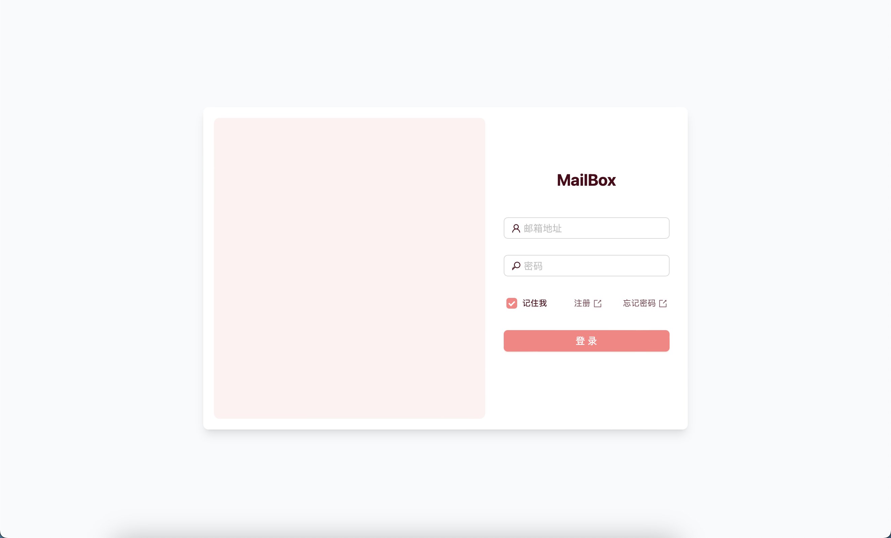

# MailBox
MailBox is a web application that allows you to send and receive emails serverlessly and costlessly with your custom domain.

MailBox 是一个允许你使用自定义域名进行免费邮件收发的 Serverless 网页应用



| Demo User | Demo Password |
|:---------:|:-------------:|
|demo@o0-0o.icu|123456|

## Usage / 部署方法
### 1 Set up Cloudflare D1 / 设置 Cloudflare D1

1.  Go to your Cloudflare Dashboard.
    > 前往 Cloudflare 控制台。
2.  Navigate to "Workers & Pages", then select the "D1" tab.
    > 导航至 "Workers & Pages"，然后选择 "D1" 标签页。
3.  Create a new D1 database or choose an existing one. Note down the database name.
    > 创建一个新的 D1 数据库或选择一个已有的。记下数据库的名称。
4.  Execute the `schema.sql` file to create the necessary tables. Run the following command in your project root, replacing `<YOUR_DATABASE_NAME>` with your actual D1 database name:
    > 执行 `schema.sql` 文件以创建必要的表。在你的项目根目录运行以下命令，并将 `<YOUR_DATABASE_NAME>` 替换为你的 D1 数据库名称：
    ```bash
    npx wrangler d1 execute <YOUR_DATABASE_NAME> --file=./schema.sql
    ```
    If you are using `wrangler dev` with a local D1 instance for development, you might need to use the `--local` flag:
    > 如果你正在使用 `wrangler dev` 和本地 D1 实例进行开发，你可能需要添加 `--local` 标志：
    ```bash
    npx wrangler d1 execute <YOUR_DATABASE_NAME> --file=./schema.sql --local
    ```

### 2 Get Resend API Key

Create a new project in [Resend](https://resend.com/), and create a new API key. Note that the domain you use in Resend should be the same as the domain you use in Cloudflare.

> 获取 [Resend](https://resend.com/) 的 API key: 在 [Resend](https://resend.com/) 中创建一个新的项目并创建一个新的 API key。请注意你在 Resend 中使用的域名应该和你在 Cloudflare 中使用的域名相同

### 3 Deploy to Vercel

Deploy this `Next.js` project to `Vercel` with the following environment variables in `Vercel` or `.env` file.

> 部署到 [Vercel](https://vercel.com/): 在 `Vercel` 中部署这个 `Next.js` 项目，并在 `Vercel` 或 `.env` 文件中设置以下环境变量

| Variable | Description | Default | Required |
|:--------:|:-----------:|:-------:|:--------:|
| `RESEND_API_KEY` | API key of Resend | | Yes |
| `PEER_AUTH_KEY` | For authenticating between Cloudflare Workers and Next.js | | Yes |
| `NEXT_PUBLIC_MAIL_SERVER` | The domain of your mail server, e.g. `mail.example.com` | | Yes |
| `REGISTRY_KEY` | If set, only users with this key can register | | |
| `NEXT_PUBLIC_REGISTRY_SET` | If `REGISTRY_KEY` is set, this should be set to `true` | | |

**Note on Database Configuration / 关于数据库配置的说明:**
This project uses Cloudflare D1. If deploying the Next.js application to Cloudflare Pages, link your D1 database in the Cloudflare Pages project settings: Go to Settings > Functions > D1 database bindings. Add a binding with the variable name `DB` and select your D1 database. This is the recommended setup.

> 本项目使用 Cloudflare D1。如果将 Next.js 应用部署到 Cloudflare Pages，请在 Cloudflare Pages 项目设置中链接你的 D1 数据库：前往 设置 > 函数 > D1 数据库绑定。添加一个变量名为 `DB` 的绑定，并选择你的 D1 数据库。这是推荐的设置。

If deploying the Next.js application to Vercel or another platform, you'll need to ensure it can access the D1 database. This might involve using Wrangler to manage the Next.js part of the application as a Worker, or using a D1 client library if direct access is supported and secure. However, Cloudflare Pages is the most straightforward deployment for D1 integration.

> 如果将 Next.js 应用部署到 Vercel 或其他平台，你需要确保它能访问 D1 数据库。这可能涉及到使用 Wrangler 将 Next.js 部分作为 Worker 管理，或者如果平台支持并且安全，使用 D1 客户端库。然而，对于 D1 集成，Cloudflare Pages 是最直接的部署方式。

### 4 Config Workers Environment Variables

Create `/workers/wrangler.toml` and add the following content. Remember to replace `<YOUR_NEXTJS_PROJECT_DOMAIN>` and `<YOUR_PEER_AUTH_KEY>` with your own.

> 设置 Cloudflare Workers 的环境变量: 创建 `/workers/wrangler.toml` 并添加以下内容, 请记得将 `<YOUR_NEXTJS_PROJECT_DOMAIN>` 和 `<YOUR_PEER_AUTH_KEY>` 替换为你自己的

```toml
#:schema node_modules/wrangler/config-schema.json
name = "mail"
main = "src/index.ts"
compatibility_date = "2024-08-01"
compatibility_flags = ["nodejs_compat"]

[vars]
NEXT_ENDPOINT = "https://<YOUR_NEXTJS_PROJECT_DOMAIN>/api/receive"
PEER_AUTH_KEY = "<YOUR_PEER_AUTH_KEY>"

[observability]
enabled = true
```

### 5 Deploy Workers

Run the following command to deploy the workers.

> 部署 Cloudflare Workers: 运行以下命令部署 Cloudflare Workers

```bash
cd ./workers # Change to workers directory to Workers project
bun install # Install dependencies
bunx wrangler login # Login to Cloudflare
bun run deploy # Deploy the workers
```

### 6 Config Cloudflare Mail route

1. Go to your domain's Cloudflare dashboard.
2. Click on the `Email` tab.
3. Click on `Email Routing`.
4. Click on `Routing Rules`.
5. Set `Catch All` to forward all mail to the workers you just deployed.

> 设置 Cloudflare 的邮件路由: 进入你的域名的 Cloudflare 控制台 -> 点击 `电子邮件` -> 点击 `邮件路由` -> 点击 `路由规则` -> 设置 `Catch All` 为转发所有邮件到你刚刚部署的 Worker

## License
[GPL-3.0](./LICENSE)

## TODO
- [x] 身份验证和用户数据存储 (Cloudflare D1)
- [x] 接收邮件功能 (Cloudflare Mail Workers -> Next.js -> Cloudflare D1)
- [x] 注册功能 (服务端注册条件控制)
- [x] 单条邮件阅读组件
- [x] 发送邮件功能 (Resend)
- [x] 支持 Markdown 写邮件 (Marked)
- [x] 已发送邮件页面
- [x] 个人资料页面 (记得游客账户不能修改)
- [x] 夜间模式
- [ ] 找回密码功能 (向备用邮箱发送验证码)
- [ ] AI 总结邮件内容生成邮件摘要 (Cloudflare Workers AI)
- [ ] 附件支持
- [ ] 邮件收藏
- [ ] 邮件提醒 (Resend Webhook -> Cloudflare Queues -> Device)
