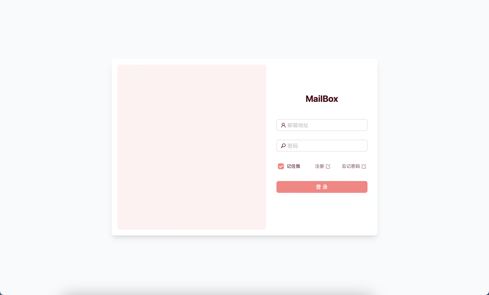

# MailBox
MailBox is a web application that allows you to send and receive emails serverlessly and costlessly with your custom domain.

MailBox 是一个允许你使用自定义域名进行免费邮件收发的 Serverless 网页应用



#### Demo User: demo@leafyee.xyz

#### Demo Password: 123456

## Usage / 部署方法
### 1 Get MongoDB Atlas URI
获取 [MongoDB Atlas](https://www.mongodb.com/) 的数据库 URI

Create a new project in [MongoDB Atlas](https://www.mongodb.com/) and get the URI of the cluster. The URI should be like `mongodb+srv://<username>:<password>@xxxxxxx.xxxxxxxx.xxxxx?xxxx=xxxx&xxxx=xxxx`, remember to replace `<username>` and `<password>` with your own.

在 [MongoDB Atlas](https://www.mongodb.com/) 中创建一个新的项目并获取集群的 URI。URI 应该类似于 `mongodb+srv://<username>:<password>@xxxxxxx.xxxxxxxx.xxxxx?xxxx=xxxx&xxxx=xxxx`，请记得将 `<username>` 和 `<password>` 替换为你自己的

### 2 Get Resend API Key
获取 [Resend](https://resend.com/) 的 API key

Create a new project in [Resend](https://resend.com/), and create a new API key. Note that the domain you use in Resend should be the same as the domain you use in Cloudflare.

在 [Resend](https://resend.com/) 中创建一个新的项目并创建一个新的 API key。请注意你在 Resend 中使用的域名应该和你在 Cloudflare 中使用的域名相同

### 3 Deploy to Vercel
部署到 [Vercel](https://vercel.com/)

Deploy this `Next.js` project to `Vercel` with the following environment variables in `Vercel` or `.env` file.

在 `Vercel` 中部署这个 `Next.js` 项目，并在 `Vercel` 或 `.env` 文件中设置以下环境变量

| Variable | Description | Default | Required |
|:--------:|:-----------:|:-------:|:--------:|
| `RESEND_API_KEY` | API key of Resend | | Yes |
| `MONGODB_URI` | URI of MongoDB Atlas | | Yes |
| `PEER_AUTH_KEY` | For authenticating between Cloudflare Workers and Next.js | | Yes |
| `NEXT_PUBLIC_MAIL_SERVER` | The domain of your mail server, e.g. `mail.example.com` | | Yes |
| `REGISTRY_KEY` | If set, only users with this key can register | | |
| `NEXT_PUBLIC_REGISTRY_SET` | If `REGISTRY_KEY` is set, this should be set to `true` | | |

### 4 Config Workers Environment Variables
设置 Cloudflare Workers 的环境变量

Create `/workers/wrangler.toml` and add the following content. Remember to replace `<YOUR_NEXTJS_PROJECT_DOMAIN>` and `<YOUR_PEER_AUTH_KEY>` with your own.

创建 `/workers/wrangler.toml` 并添加以下内容, 请记得将 `<YOUR_NEXTJS_PROJECT_DOMAIN>` 和 `<YOUR_PEER_AUTH_KEY>` 替换为你自己的

```toml
#:schema node_modules/wrangler/config-schema.json
name = "mail"
main = "src/index.ts"
compatibility_date = "2024-08-01"
compatibility_flags = ["nodejs_compat"]

[vars]
NEXT_ENDPOINT = "https://<YOUR_NEXTJS_PROJECT_DOMAIN>/api/receive"
PEER_AUTH_KEY = "<YOUR_PEER_AUTH_KEY>"
```

### 5 Deploy Workers
部署 Cloudflare Workers

Run the following command to deploy the workers.

运行以下命令部署 Cloudflare Workers

```bash
cd ./workers # Change to workers directory to Workers project
bun install # Install dependencies
bunx wrangler login # Login to Cloudflare
bun run deploy # Deploy the workers
```

### 6 Config Cloudflare Mail route
设置 Cloudflare 的邮件路由

1. Go to your domain's Cloudflare dashboard.
2. Click on the `Email` tab.
3. Click on `Email Routing`.
4. Click on `Routing Rules`.
5. Set `Catch All` to forward all mail to the workers you just deployed.

---

1. 进入你的域名的 Cloudflare 控制台
2. 点击 `电子邮件`
3. 点击 `邮件路由`
4. 点击 `路由规则`
5. 设置 `Catch All` 为转发所有邮件到你刚刚部署的 Worker

## License
[GPL-3.0](./LICENSE)

## TODO
- [x] 身份验证和用户数据存储 (MongoDB)
- [x] 接收邮件功能 (Cloudflare Mail Workers -> Next.js -> MongoDB)
- [x] 注册功能 (服务端注册条件控制)
- [x] 单条邮件阅读组件
- [x] 发送邮件功能 (Resend)
- [x] 支持 Markdown 写邮件 (Marked)
- [x] 已发送邮件页面
- [x] 个人资料页面 (记得游客账户不能修改)
- [ ] 夜间模式
- [ ] 找回密码功能 (向备用邮箱发送验证码)
- [ ] AI 总结邮件内容生成邮件摘要 (Cloudflare Workers AI)
- [ ] 附件支持
- [ ] 邮件收藏
- [ ] 邮件提醒 (Resend Webhook -> Cloudflare Queues -> Device)
